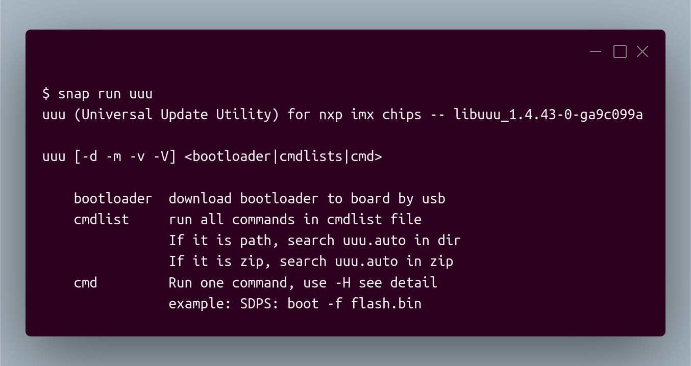

# Unofficial Snap Packaging for Universal Update Utility
<!--
	Use the Staticaly service for easy access to in-repo pictures:
	https://www.staticaly.com/
-->
 Icon of Universal Update Utility")

**This is the unofficial snap for Universal Update Utility**, *"Freescale/NXP I.MX Chip image deploy tools"*. It works on Ubuntu, Fedora, Debian, and other major Linux distributions.

<!-- Uncomment and modify this when you are provided a build status badge

-->

Published for  with 💝 by Snapcrafters

<!-- Uncomment and modify this when you have published the snap to the Snap Store
## Installation
([Don't have snapd installed?](https://snapcraft.io/docs/core/install))

### In a Terminal
    # Install the snap #
    sudo snap install --channel=beta universal-update-utility
    #sudo snap install universal-update-utility

    sudo snap alias universal-update-utility uuu
    
    # Connect the snap to essential security confinement interfaces #
    ## Allow the snap to communicate to USB devices with custom protocol ##
    sudo snap connect universal-update-utility:raw-usb
    
    # Connect the snap to optional security confinement interfaces #
    ## Allow the snap to access files under /media ##
    sudo snap connect universal-update-utility:removable-media

### The Graphical Way

-->

## What is Working
* Flashing compatible devices

## What is NOT Working...yet 
Check out the [issue tracker](https://github.com/Lin-Buo-Ren/uuu-snap/issues) for known issues.

## Support
* Report issues regarding using this snap to the issue tracker:  
  <https://github.com/Lin-Buo-Ren/uuu-snap/issues>
* You may also post on the Snapcraft Forum, under the `snap` topic category:  
  <https://forum.snapcraft.io/c/snap>
